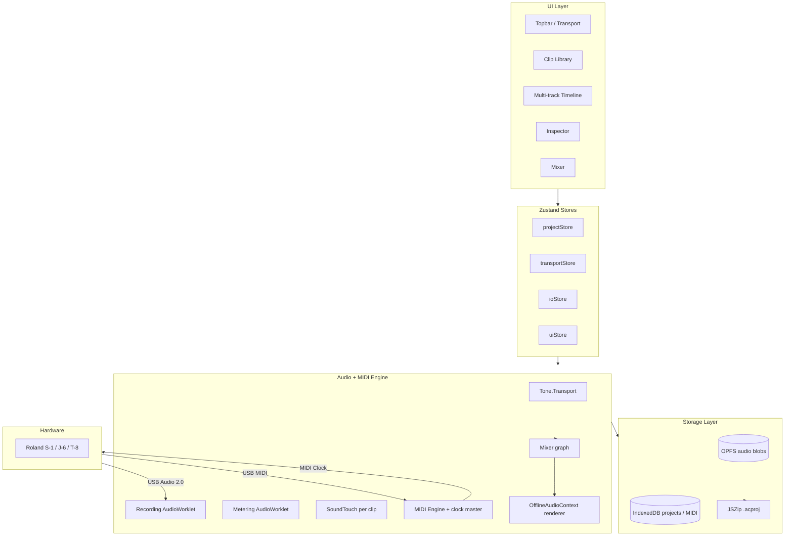

# AudioCake — Architecture

## High-level diagram



## Data model (target — fleshed out in Phase 1)

```typescript
type Project = {
  id: string // ULID
  name: string
  bpm: number
  timeSignature: [number, number]
  sampleRate: 44100 | 48000
  tracks: Track[]
  clips: Clip[]
  audioAssets: AudioAssetRef[] // metadata only; blobs in OPFS
  midiAssets: MidiAssetRef[]
  loopRegion: { start: number; end: number } | null
  createdAt: number
  updatedAt: number
  version: number // schema version
}

type Track = {
  id: string
  name: string
  kind: 'audio' | 'midi'
  color: string
  gain: number // dB
  pan: number // -1..1
  mute: boolean
  solo: boolean
  recordArm: boolean
  input?: { deviceId: string; channel?: number } | { midiPortId: string; midiChannel: number }
}

type Clip = {
  id: string
  trackId: string
  assetId: string
  startTime: number // seconds on timeline
  offset: number // seconds into asset (trim from start)
  duration: number // seconds
  fadeIn: number
  fadeOut: number
  gain: number // dB
  timeStretch: number // 1.0 = native
  pitchSemitones: number
  reverse: boolean
  name: string
}
```

Non-destructive by design: clips reference assets; trim/fade/stretch/pitch/reverse/gain are clip-level, applied identically at playback and at export by sharing one render-graph builder.

## Folder structure (target)

```
audiocake/
  app/                          # Next.js App Router
  src/
    components/
      topbar/                   # Transport, project, export
      timeline/                 # Tracks, clips, ruler, playhead
      library/                  # Clip library, asset list
      inspector/                # Selected clip properties
      mixer/                    # Channel strips
      io/                       # Device pickers, level meters
      ui/                       # shadcn primitives
    lib/
      types.ts
      audio/
        engine.ts               # Tone.Transport wrapper, master out
        recorder.ts             # AudioWorklet recording
        worklets/
          recording-processor.ts
          meter-processor.ts
        soundtouch.ts           # SoundTouch AudioWorklet wrapper
        exporter.ts             # OfflineAudioContext bounce
        wav-encoder.ts          # 16/24-bit PCM WAV
      midi/
        engine.ts               # Web MIDI in/out, clock master
        recorder.ts
        player.ts
      storage/
        opfs.ts                 # Audio blob CRUD
        idb.ts                  # Dexie wrapper for projects
        project-io.ts           # .acproj zip import/export
        migrations.ts           # Schema versioning
      state/
        project-store.ts        # Zustand: project + history
        transport-store.ts
        io-store.ts
        ui-store.ts
      utils/
        time.ts                 # bars/beats <-> seconds
        keymap.ts
    hooks/
      useAudioInputs.ts
      useMidiInputs.ts
      useKeyboardShortcuts.ts
      useUndoRedo.ts
  public/worklets/              # Built worklet bundles
  docs/                         # This folder
```

## Key technical contracts

- **Recording reliability**: transferable `Float32Array` buffers + stop handshake with 1 s drain timeout = no lost audio at stop. Periodic OPFS flush every 5 s during record for crash recovery.
- **Latency-compensated overdub**: `offset = Tone.Transport.seconds - audioContext.outputLatency - audioContext.baseLatency` (clamped ≥ 0).
- **Mono-to-stereo upmix** happens immediately after the recording worklet so the entire downstream engine is stereo-only.
- **MIDI as transport master** by default: 24 PPQN clock + Start/Stop/Continue messages on the selected output port.
- **OPFS + IndexedDB split**: binary in OPFS (fast, no serialization tax), structured data in IndexedDB via Dexie (queryable, transactional).
- **Schema versioning**: `project.version` integer + migrations table in `storage/migrations.ts` for forward-compatible projects.
- **Export pipeline** is one function with a `format` parameter so all formats (MP3 / AAC / WAV / Opus) share the OfflineAudioContext render and differ only at the encoder boundary.
- **Storage persistence**: `navigator.storage.persist()` requested on first record to prevent eviction.
- **TS strict** everywhere, no `any`; engine modules return discriminated unions for error states instead of throwing.

## State management

Zustand 5 + Immer + Zundo. Four stores:

- `projectStore`: tracks, clips, assets, bpm, sample rate. Undo-tracked.
- `transportStore`: playhead, BPM, loop region, play/record state. Not undo-tracked.
- `ioStore`: audio input devices, MIDI ports, monitoring/count-in flags.
- `uiStore`: selection, zoom, panel sizes, snap settings. Not undo-tracked.

## Update log

- **2026-05-21**: Initial seed from plan. Phase 0 in progress.
